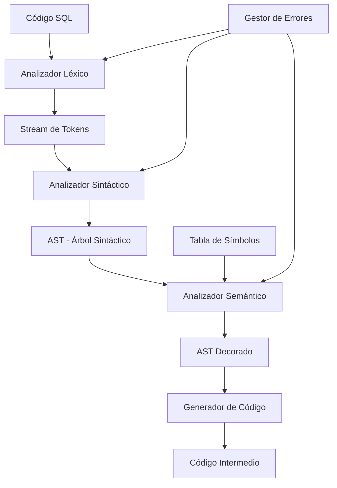

# Compilador SQL - Proyecto Final
## Curso de Compiladores - 7mo Semestre

[](https://isocpp.org/)
[](https://github.com/compilations-teams/compilador-sql-final)
[](LICENSE)
[](tests/)

## 📚 Descripción

Este proyecto implementa un **compilador SQL completo** desarrollado con metodología **Test-Driven Development (TDD)**, diseñado específicamente para el aprendizaje de conceptos fundamentales de compiladores en el 7mo semestre de Ingeniería en Sistemas.

### 🎯 Objetivos Didácticos

1. **Análisis Léxico**: Comprensión de tokens, lexemas, expresiones regulares y autómatas finitos
2. **Análisis Sintáctico**: Dominio de gramáticas libres de contexto, árboles sintácticos y AST
3. **Análisis Semántico**: Validación de tipos, ámbitos, y decoración del AST
4. **Generación de Código**: Traducción a código intermedio y optimización
5. **TDD**: Desarrollo dirigido por pruebas para garantizar calidad y comprensión

## 🚀 Características

- ✅ **Soporte SQL Básico**: SELECT, INSERT, UPDATE, DELETE, CREATE TABLE, DROP TABLE
- ✅ **Análisis Completo**: Léxico, Sintáctico y Semántico
- ✅ **Tabla de Símbolos**: Gestión eficiente de identificadores y tipos
- ✅ **Manejo de Errores**: Reportes detallados con línea y columna
- ✅ **Suite de Tests**: Cobertura completa con Google Test
- ✅ **Documentación Educativa**: Comentarios explicativos en cada fase

## 📋 Prerrequisitos

### 🐧 Linux (Ubuntu/Debian)
```bash
# Actualizar repositorios
sudo apt update

# Compilador C++17
sudo apt install build-essential g++ cmake

# Google Test Framework
sudo apt install libgtest-dev

# Herramientas adicionales
sudo apt install git make valgrind gdb

# Para análisis de cobertura (opcional)
sudo apt install lcov gcovr
```

### 🍎 macOS
```bash
# Instalar Homebrew si no lo tienes
/bin/bash -c "$(curl -fsSL https://raw.githubusercontent.com/Homebrew/install/HEAD/install.sh)"

# Herramientas de desarrollo
brew install cmake
brew install googletest
brew install lcov  # Opcional para cobertura

# Xcode Command Line Tools (si no están instaladas)
xcode-select --install
```

### 🪟 Windows 11

#### Opción 1: WSL2 (Recomendado)
1. Instalar WSL2:
   ```powershell
   # PowerShell como Administrador
   wsl --install
   ```

2. Reiniciar y seguir instrucciones de Linux arriba

#### Opción 2: MSYS2/MinGW
1. Descargar e instalar [MSYS2](https://www.msys2.org/)

2. En terminal MSYS2:
   ```bash
   # Actualizar sistema
   pacman -Syu
   
   # Instalar herramientas
   pacman -S mingw-w64-x86_64-gcc mingw-w64-x86_64-cmake mingw-w64-x86_64-gtest make git
   ```

## 🔧 Instalación

### 1. Clonar el repositorio
```bash
git clone https://github.com/compilations-teams/compilador-sql-final.git
cd compilador-sql-final
```

### 2. Compilar el proyecto
```bash
# Compilar todo (compilador + tests)
make all

# Solo el compilador
make compiler

# Solo los tests
make tests
```

### 3. Ejecutar tests
```bash
# Ejecutar suite completa
make test

# Con cobertura (si está instalado lcov)
make coverage
```

## 🎮 Uso

### Compilar una consulta SQL
```bash
# Desde archivo
./sql-compiler archivo.sql

# Modo interactivo
./sql-compiler
SQL> SELECT * FROM usuarios WHERE edad > 18;
```

### Ejemplos incluidos
```bash
# Probar ejemplos
./sql-compiler examples/select_basic.sql
./sql-compiler examples/create_table.sql
./sql-compiler examples/complex_join.sql
```

## 🧪 Test-Driven Development

Este proyecto sigue estrictamente TDD. Cada funcionalidad fue desarrollada siguiendo el ciclo:

1. **🔴 Red**: Escribir test que falla
2. **🟢 Green**: Implementar código mínimo para pasar
3. **🔵 Refactor**: Mejorar código manteniendo tests verdes

### Estructura de Tests
```
tests/
├── lexer_test.cpp       # Tests del analizador léxico
├── parser_test.cpp      # Tests del analizador sintáctico  
├── semantic_test.cpp    # Tests del análisis semántico
├── integration_test.cpp # Tests de integración completa
└── fixtures/           # Archivos SQL de prueba
```

### Ejecutar test específico
```bash
# Solo tests del lexer
./tests/lexer_test

# Con verbosidad
./tests/lexer_test --gtest_verbose
```

## 📐 Arquitectura



## 🛠️ Configuración VS Code

### Extensiones Recomendadas

#### Para todos los sistemas operativos:
```json
{
  "recommendations": [
    "ms-vscode.cpptools",
    "ms-vscode.cmake-tools", 
    "twxs.cmake",
    "matepek.vscode-catch2-test-adapter",
    "ryanluker.vscode-coverage-gutters",
    "jeff-hykin.better-cpp-syntax",
    "cschlosser.doxdocgen",
    "streetsidesoftware.code-spell-checker",
    "streetsidesoftware.code-spell-checker-spanish"
  ]
}
```

### Configuración de tareas (`.vscode/tasks.json`)
```json
{
  "version": "2.0.0",
  "tasks": [
    {
      "label": "Build Compiler",
      "type": "shell",
      "command": "make",
      "args": ["compiler"],
      "group": {
        "kind": "build",
        "isDefault": true
      }
    },
    {
      "label": "Run Tests",
      "type": "shell",
      "command": "make",
      "args": ["test"],
      "group": "test"
    },
    {
      "label": "Clean Build",
      "type": "shell",
      "command": "make",
      "args": ["clean"],
      "group": "build"
    }
  ]
}
```

### Configuración de debug (`.vscode/launch.json`)
```json
{
  "version": "0.2.0",
  "configurations": [
    {
      "name": "Debug Compiler",
      "type": "cppdbg",
      "request": "launch",
      "program": "${workspaceFolder}/sql-compiler",
      "args": ["examples/select_basic.sql"],
      "stopAtEntry": false,
      "cwd": "${workspaceFolder}",
      "environment": [],
      "externalConsole": false,
      "MIMode": "gdb",
      "setupCommands": [
        {
          "description": "Enable pretty-printing for gdb",
          "text": "-enable-pretty-printing",
          "ignoreFailures": true
        }
      ]
    },
    {
      "name": "Debug Tests",
      "type": "cppdbg",
      "request": "launch",
      "program": "${workspaceFolder}/tests/all_tests",
      "args": [],
      "stopAtEntry": false,
      "cwd": "${workspaceFolder}",
      "MIMode": "gdb"
    }
  ]
}
```

## 📚 Material de Estudio

### Conceptos Clave por Módulo

#### 1. Análisis Léxico (`src/Lexer.cpp`)
- **Tokens y Lexemas**: Identificación de unidades léxicas
- **Expresiones Regulares**: Patrones para reconocimiento
- **Autómatas Finitos**: DFA para procesamiento eficiente
- **Buffer Management**: Técnicas de doble buffer

#### 2. Análisis Sintáctico (`src/Parser.cpp`) 
- **Gramática SQL**: BNF adaptada para SQL
- **Parsing Descendente Recursivo**: Implementación clara y educativa
- **Manejo de Precedencia**: Operadores y expresiones
- **Recuperación de Errores**: Estrategias panic mode

#### 3. Análisis Semántico (`src/SemanticAnalyzer.cpp`)
- **Type Checking**: Validación de tipos en operaciones
- **Scope Resolution**: Manejo de ámbitos y visibilidad
- **Symbol Table**: Estructura eficiente con hash tables
- **AST Decoration**: Anotación con información semántica

## 🤝 Contribución

Este repositorio está configurado para aprendizaje colaborativo:

### Para Estudiantes
1. **Fork** el repositorio (no clone directo)
2. Crear **branch** con formato: `feature/nombre-apellido-funcionalidad`
3. Implementar siguiendo **TDD**
4. Crear **Pull Request** con descripción detallada
5. Code review por compañeros antes de merge

### Reglas de Contribución
- ✅ Todos los PR deben incluir tests
- ✅ Los tests deben pasar en CI/CD
- ✅ Código debe seguir estilo Google C++
- ✅ Documentar cambios significativos
- ❌ NO hacer push directo a `main`
- ❌ NO merge sin review de al menos 1 compañero

## 📖 Recursos Adicionales

### Libros Recomendados
- "Compilers: Principles, Techniques, and Tools" - Aho, Lam, Sethi, Ullman (Dragon Book)
- "Modern Compiler Implementation in C++" - Andrew W. Appel
- "Engineering a Compiler" - Cooper & Torczon

### Herramientas Complementarias
- [ANTLR](https://www.antlr.org/) - Generador de parsers
- [Flex/Bison](https://www.gnu.org/software/bison/) - Herramientas clásicas
- [LLVM](https://llvm.org/) - Framework de compiladores moderno

### Videos y Tutoriales
- [Playlist Compiladores UMG](https://youtube.com/playlist/compiladores-umg)
- [TDD en C++ con Google Test](https://youtube.com/tdd-cpp-gtest)

## 📝 Licencia

Este proyecto es software educativo bajo licencia MIT. Ver [LICENSE](LICENSE) para más detalles.

## 👥 Equipo

**Profesor**: Ing. Richard Ortiz
**Asistentes de Cátedra**: Por asignar
**Administrador del Repo**: @rortizs

---

### ⚠️ Nota Importante para Estudiantes

Este proyecto es una herramienta de **aprendizaje activo**. No copies código sin entender:

1. **Estudia** cada componente antes de modificar
2. **Experimenta** con los tests para entender el comportamiento
3. **Pregunta** en Issues si algo no está claro
4. **Colabora** ayudando a otros estudiantes

> "El objetivo no es tener un compilador funcionando, sino **entender cómo funciona un compilador**" - Curso Compiladores 2026

## 🆘 Soporte

- **Issues**: [GitHub Issues](https://github.com/compilations-teams/compilador-sql-final/issues)
- **Discussions**: [GitHub Discussions](https://github.com/compilations-teams/compilador-sql-final/discussions)
- **Email**: compiladores2026@umg.edu.gt

---
*Última actualización: Marzo 2026*